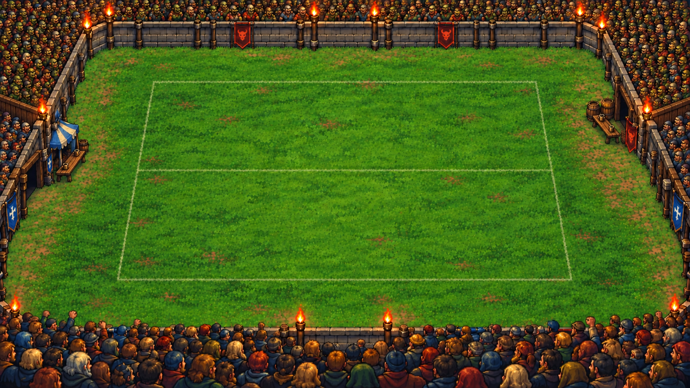
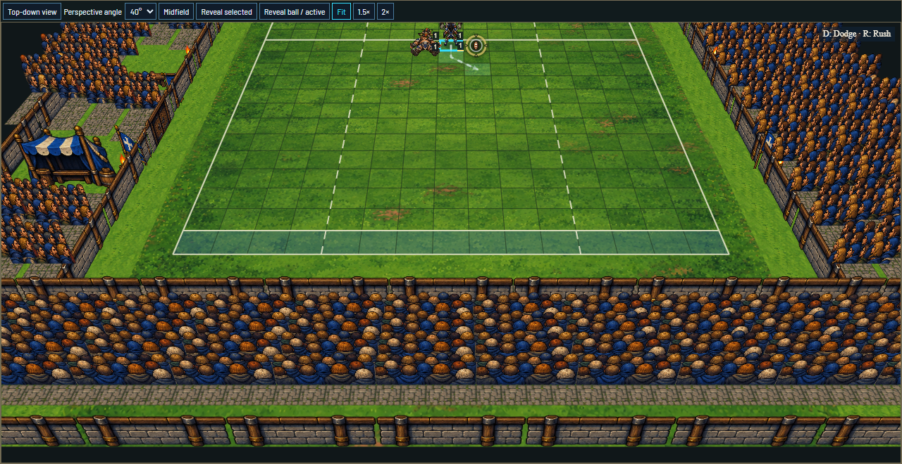
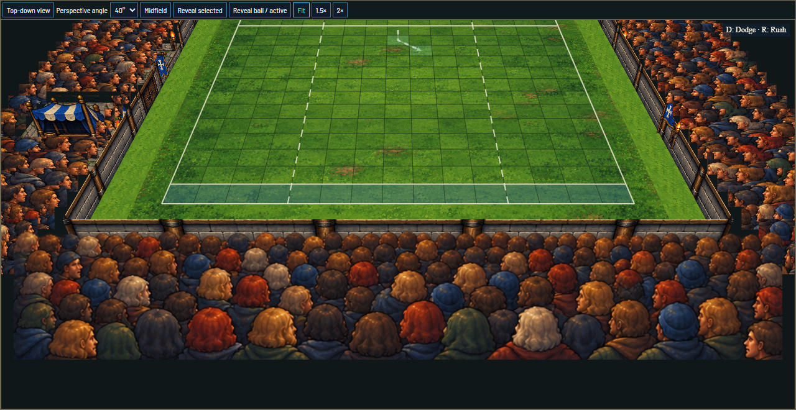
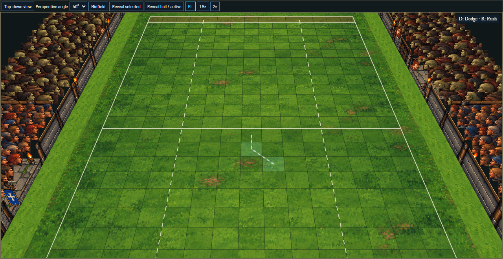
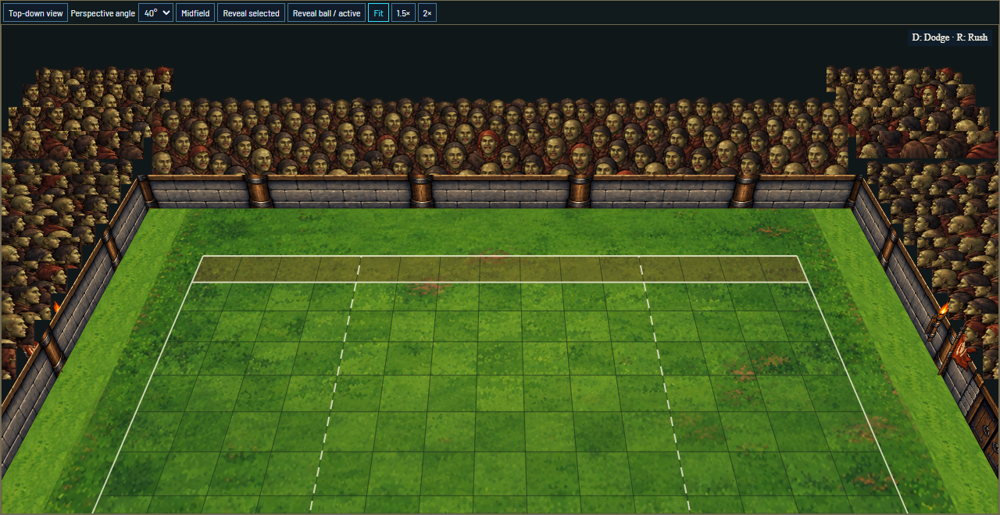
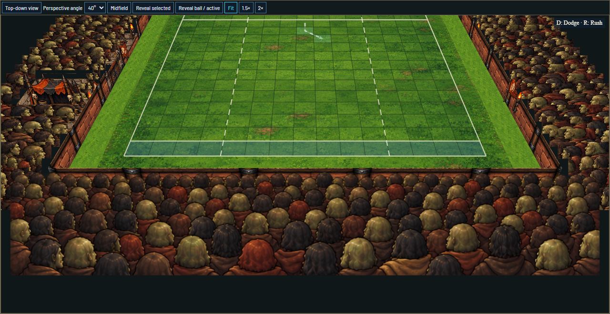
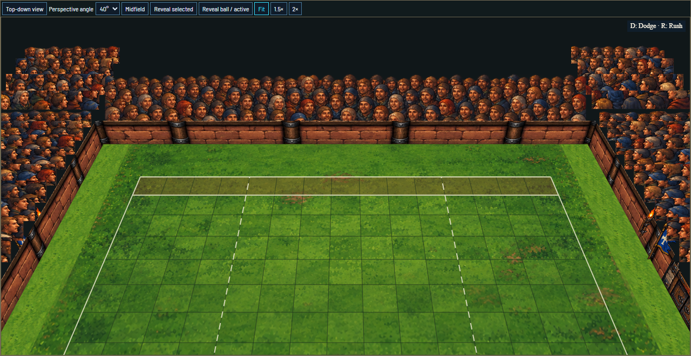
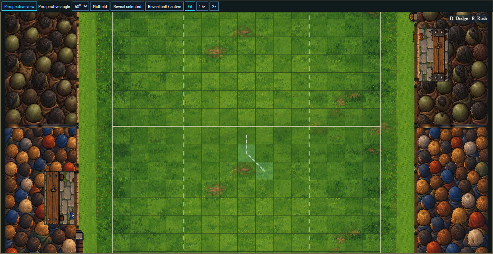
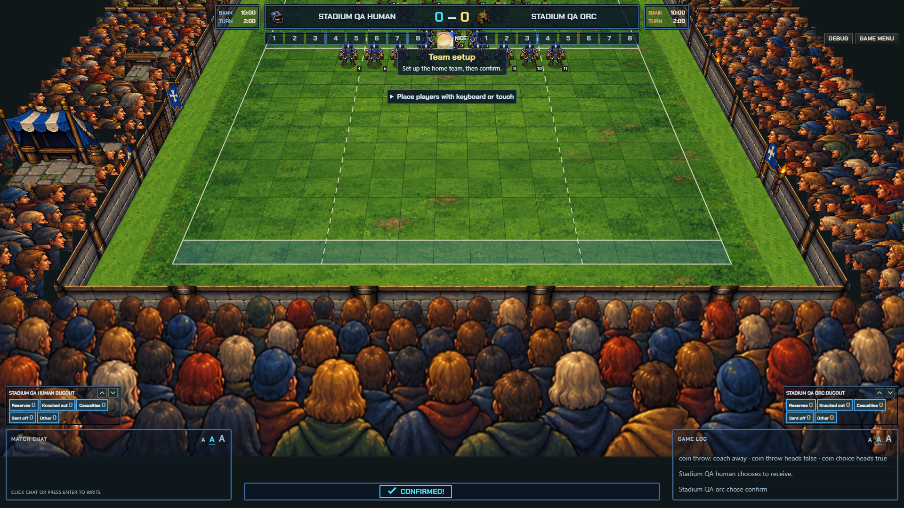

# Assembled jigsaw stadium review

These are captures of the production LivePitch renderer with an empty pitch for art inspection. The native pitch, camera and 390 playable cells are unchanged. Camera travel intentionally crops the outer bowl; this is the live game's framing.

The earlier repeated-card renderer is superseded. The current pieces reproduce the raised, inward-looking bank approach; these captures are review evidence, not an assertion of owner acceptance.

## Reference and previous renderer

The current gallery includes independent-review corrections to end/corner head scale and field-level bench bays.

## Human venue with Human/Orc sections

## Orc venue with Orc/Human sections

## Overhead

The crowd bases remain still. Separate local frame patches give occasional gestures by randomly selected visible section. See [the motion observations](motion.json) and the [authoring contract](../../../pitch/stadiums/jigsaw/source/README.md).

The captures use both venue families and preserve canonical supporter ownership. The automated renderer matrix covers both viewing ends, 30/40/50 degrees and overhead, and near/mid/far travel. Native reconnect/replay completion is pending refreshed local DEV credentials.

## Earlier native Human fixture

This native capture predates the latest end-bank density and field-level pocket corrections. Human-home camera captures and first/last completed replay were recorded before the local Google Cloud session expired. The full native rerun for both hosting arrangements remains open.
