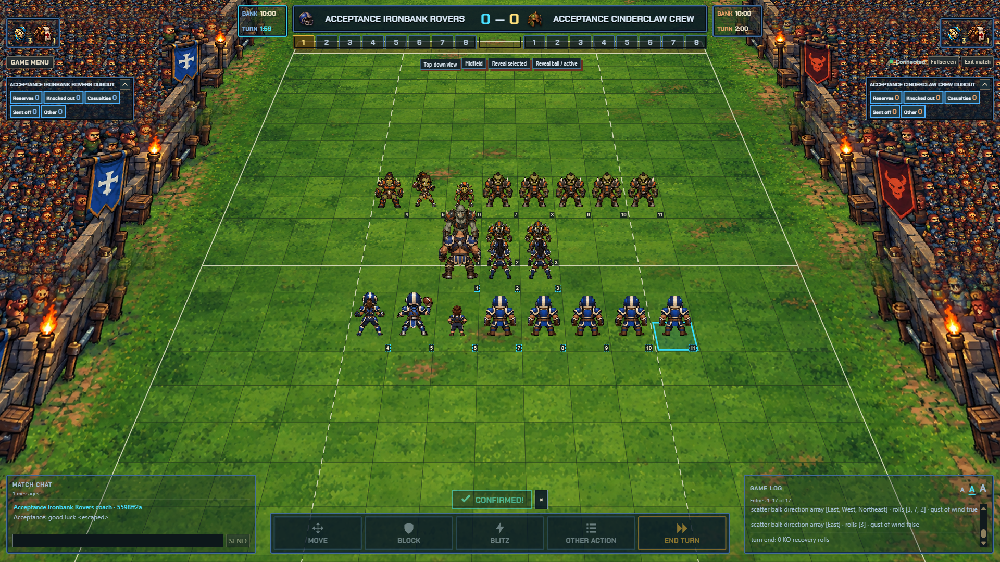
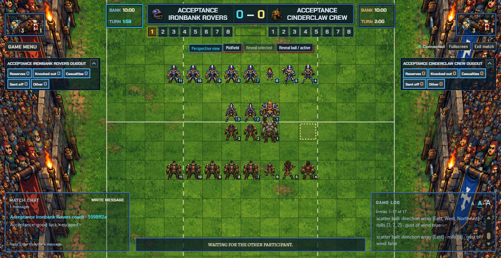

# Coach-oriented match UI: local acceptance

Status: required local match acceptance and replay cutover passed on 2026-10-04. Hosted signed-in release acceptance remains separate. The final cutover PR/check/merge cycle and retrospective remain in progress.

## Reproducible environment

The acceptance profile uses Compose project `ffb-v2-acceptance`, database volume `ffb-v2-acceptance_database`, MariaDB on loopback 23318 and the Java server on loopback 22235. Its proxy on 22232 serves the normal `/browser/v2` path to local Hosting on localhost:5000. The existing `ffb-match-review` containers, database and private records remain separate.

The schema bootstrap creates no coach/account/team rows. It accepts only the dedicated database URL and exact schema inventory; interrupted migration recovery requires empty data tables. Marker 7 is verification only. Normal application authentication and create/invite/join operations create the acceptance accounts and match memberships.

Real DEV Firebase custom tokens use a dedicated `coach-ui-acceptance` signing account with no project roles. The owner approved a custom role containing only `iam.serviceAccounts.signBlob`, bound on that account to the administrator. This replaces the attempted Firebase-admin signer. ADC and tokens stay outside tracked files. The current standard ADC is verified and carries the DEV quota project; the older review-mounted credential is not rewritten.

Prerequisites: Docker, the repository's supported Java/Maven toolchain, Node 24 for browser tooling, system Node 26 for the computer process, refreshed DEV ADC and the scoped signer permission. The existing review containers provide verified read-only local secret-file locations; no records are copied from their database.

```powershell
# With Node 24 first in PATH:
node tools/acceptance-local-server.mjs --start
node tools/coach-match-acceptance.mjs --start-browser
$env:COACH_ACCEPTANCE_TOKENS_FILE = (Resolve-Path .tools/coach-oriented-match-ui/coach-tokens.json).Path
node tools/coach-match-acceptance.mjs --test
node tools/coach-match-acceptance.mjs --stop-browser
```

The browser stop command verifies its unique per-run command line before signaling a process. It retains database volumes and cannot stop dev-local Hosting by its shared executable name. The server launcher verifies the separate Compose volume and fails closed on an unexpected schema. Repeated runs use fresh synthetic Firebase identities; no private account/team data enters evidence.

To continue a retained acceptance match after rebuilding, preserve its ignored token file and use `--start --resume-identities <ignored-token-file>`. This validates role-specific synthetic UIDs before any mutation and atomically refreshes their tokens after success. Set `COACH_ACCEPTANCE_RESUME_FROM` to the prior ignored failure evidence before running `--test`; the runner loads the real retained match and continues through the production UI. It never creates a replacement engine state. Set `COACH_ACCEPTANCE_COMPUTER=1` for the existing computer daemon path and `COACH_ACCEPTANCE_FOREGROUND=1` / `COACH_ACCEPTANCE_PRESENTATION=1` for foreground presentation coverage.

## Evidence ledger

| Gate | Current evidence |
| --- | --- |
| Geometry, art and fixed HUD | Merged slices 2–5; forward/inverse and both-end checks, canonical anchors, unavailable art and registered travelling scenery |
| Dice and movement | Merged slice 6; actual offered faces, independent short effects, required-prompt interruption, ordered reduced-motion updates and stale-timer cancellation |
| Native scenarios | Full Java clean install: 697 tests, zero failures/errors, nine existing opt-in environment skips. Native suites cover halftime, touchdown/reset/retry, movement/rush/dodge interruptions, resource consumption, skills, push/follow-up, injuries/apothecary, passes/interceptions/foul and big/small-player interactions |
| Hosted text fallback | Regression now stages every offered action through Other action without mutation until confirmation; the selector previously had a hosted-only rendering omission |
| Live full match | Fresh Human/Orc match `1d9a0f2e-df34-3e01-a259-38ac2b4659f9`, natural full time 2–1, revision 393 / 394 recorded events; two independent coaches and spectator agree throughout |
| Continuity and permissions | Real UI pending-decision reconnect, discarded uncommitted route on reconnect, server route preview/Undo/Clear/confirmation, save/accept/suspend/reconnect/resume, escaped durable chat, rejected wrong-coach/spectator/stale intentions, authoritative final result and backward replay seek all passed |
| Computer opponent | Existing Bugman daemon and browser Human coach completed `f3a0dba4-8683-310a-b6a2-a9cf7fe98ac2`, natural full time 1–0, revision 560 / 561 events; independently subscribed spectators converge. The run resumed its native revision-520 checkpoint after the bounded storage repair |
| Browser/foreground/zoom | Foreground Chrome, both coach ends and projections at all four specified desktop viewports; actual 100%/200% per-tab browser zoom, Edge smoke, reduced motion, blocked art and keyboard inspection passed. Corrected native-window screenshot export also passed |
| Schema and helper safety | Fresh marker-7 bootstrap, retained records on restart, scoped Java regressions and three launcher tests pass. Independent review approved storage bounds, authorization, completed-state metadata and process/identity ownership |

Reviewable evidence is in [references/coach-oriented-match-ui](references/coach-oriented-match-ui/): [fresh coach match](references/coach-oriented-match-ui/human-match.json), [computer match](references/coach-oriented-match-ui/computer-match.json), [foreground measurements](references/coach-oriented-match-ui/presentation.json), [Edge](references/coach-oriented-match-ui/edge.json), [live native zoom](references/coach-oriented-match-ui/native-zoom-live.json) and [corrected native export](references/coach-oriented-match-ui/native-zoom-export.json). Full development logs and screenshots remain ignored under `.tools/coach-oriented-match-ui/`. No authentication requests or credentials are included.





The fresh coach match built and froze eleven players per side through the real builder, covering all twelve position archetypes. The computer evidence lists its frozen team positions from the retained native revision-520 snapshot; its original UI creation and both-half checkpoints remain in the combined evidence. Neither run uses fixture responses or forced full time. The older coach match `b97d266e-c918-3935-b68e-8d00341cd0f0` additionally verified retained completed-load/result authorization after a server restart. Fresh spectators cannot live-watch an inactive completed match; its registered public transcript remains readable, preserving the existing v2 policy.

The test machine ran Windows 11, an AMD Ryzen 7 260 (8 cores / 16 logical processors), 16.4 GB physical RAM, Radeon 780M and RTX 5060 Laptop graphics. Runtime versions: Chrome 154.0.8037.93, Edge 154.0.4258.53, bundled Chromium 151 for the temporary native-zoom extension, Node 24.19.0 for browser tooling, Node 26.7.0 for the computer player, Temurin 21.0.11+10 and Maven 3.9.9, MariaDB 11.8.9. Native zoom uses a real browser window with no device-metrics emulation; the operating-system DPR is 2 and becomes 4 at 200%, while the CSS viewport changes from 1280×660 to 640×330. The corrected export retains the same 2560×1320 physical window at both zoom levels. Its screenshot shows the retained full-time match; live zoom interaction/fallback checks used the paused populated match. The previous Playwright CSS-clipped export was discarded.

Foreground measurements cover eight paused populated scene configurations and four bounded camera gestures. The latest input-to-camera observation was 15.7 ms, and sampled JS heap changed from 15.1 MB to 28.5 MB. Frame interval samples and their distributions are preserved in the JSON. These are bounded foreground observations, not sustained animation or memory-leak benchmarks.

## Repairs established by acceptance

The UI now permits every offered action in its hosted text fallback, excludes exhausted players from setup placement, and retains usable controls/inspectors in short windows. Completed projections consistently include caller-specific save metadata on load and exact retry. Result/replay reads resolve the authenticated account to its actual home/away membership before invoking the internal role-based service; outsiders still fail authorization.

The computer run exposed the old separate 7 MiB replay/transcript limits before full time. Lossless bounded compression now applies only at rest, through both JDBC repositories and the direct computer-preparation reader. Existing SQL encoded caps remain 16 MiB plus 64 KiB for prepared rows and 32 MiB for recovery rows. Decoded completed/transcript/recovery budgets are 64/32/128 MiB; the pre-command aggregate guard includes actual serialized chat with a 1 MiB reserve. Strict version, fields, canonical base64, UTF-8, gzip member, length and CRC checks reject corruption and expansion beyond the cap. JDBC compare-and-swap and unknown-outcome semantics stay intact. Active computer scans exclude completed documents in SQL without an arbitrary job limit.

Compatibility: older binaries cannot read newly compressed rows. Roll out the codec readers with the writers, and retain those readers during a rollback. Legacy raw rows remain readable; no SQL migration or public projection/transcript format changed.

Local verification also passed 140 browser unit tests, all seven interaction runners, reconnect coverage, both browser builds, eight computer-player tests and 166 asset checks. Site checks, six unit tests and ten browser scenarios pass. The nine Maven skips require explicitly configured JDBC or retained-reference environments; they were not disabled or counted as passing. The actual isolated v2 UI matches independently exercise the required local transport, durable storage and recovery paths.

Final [real replay cutover evidence](references/coach-oriented-match-ui/replay-cutover.json) verifies both actual coach accounts read the same retained result and inspect its recorded players on the pitch and in the dugouts. Both camera ends and both projections retain all 390 cells and the same 22 player identities; zero mutation requests are sent. [The real result/replay screenshot](references/coach-oriented-match-ui/replay.png) complements the live pitch views above. The hosted replay regression originally failed on the missing away-view control and now passes with camera/inspector/dugout checks.

For this read-only check, run `node browser-client/test/real-server-replay.mjs` with `COACH_ACCEPTANCE_TOKENS_FILE` and `COACH_ACCEPTANCE_COMPLETED_FILE` pointing to a retained acceptance identity file and the corresponding passed match evidence. Refresh only those synthetic identities if their custom tokens expire.

Hosted signed-in account acceptance, production stadium refinement, overtime, yaw and additional team art remain separate release/future work.
