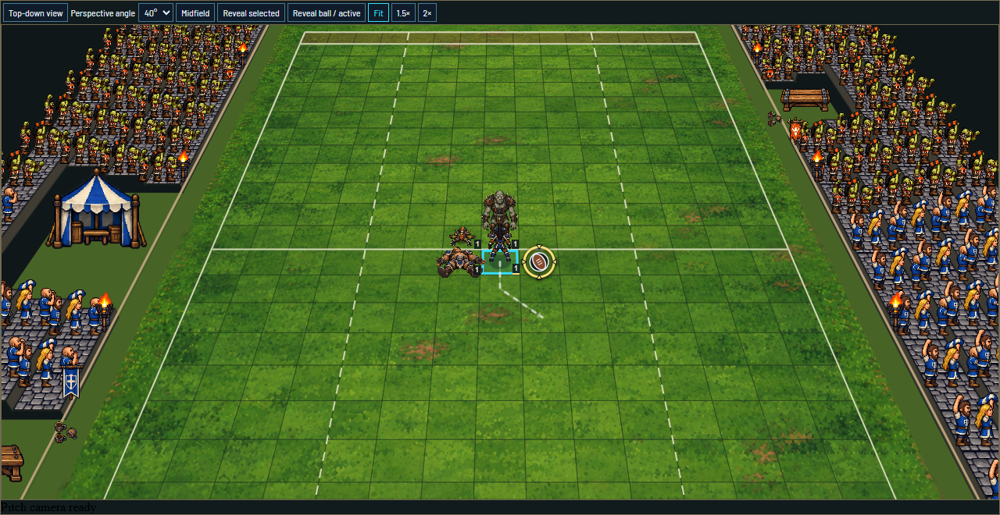
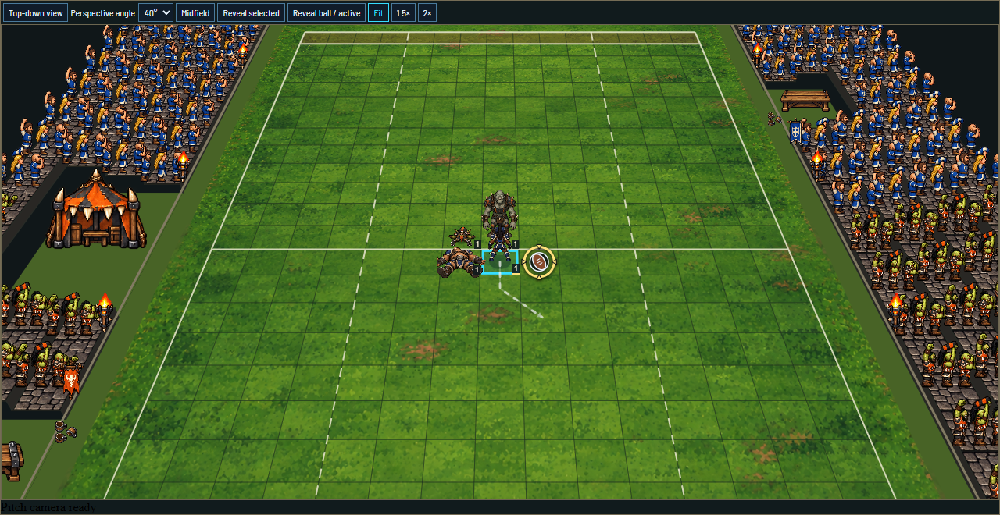

# League stadium MVP retrospective

Historical assessment: the owner subsequently rejected the initial stadium/crowd composition. Its visual and intent-success claims are superseded by the [jigsaw revision audit](stadium-jigsaw-retrospective.md) and current approved bowl brief. The original merged-slice history and test evidence below remain historical records.

Date: 2026-10-07 (local session date). Tracker: [#198](https://github.com/the-grognard-codes/fumbbl-rebuild/issues/198).

The delivered stadium work matches the confirmed MVP's functional requirements, visual direction and intent within the verification limits below. Both leagues have complete venue and supporter families; either team can host, visiting supporters retain their identity, and the surroundings form a camera-registered world layer with restrained ambient motion. This is the stadium-only workstream. The other gameplay, chat, logging and match-launch changes remain separate work.

The reference plan is [League stadium MVP](../specs/league-stadium-mvp.md), including its 48 stories, confirmed decisions, art briefs and future-League checklist. The [original implementation baseline of that plan](https://github.com/the-grognard-codes/fumbbl-rebuild/blob/f3c3e1d2ac8764561884551173b737b0d2f4dbbf/docs/specs/league-stadium-mvp.md) preserves the requirements before the Orc and motion slices. This audit compares the outcome to those requirements, not just to passing tests.

## Delivery

| Slice | Delivered outcome | Review and publication |
| --- | --- | --- |
| 1 — Human venue and identity | Frozen Match-team presentation, Old World Classic venue, four-sided geometry, margins, recesses, cutaways, shared projection and compatible recovery/replay | [#200](https://github.com/the-grognard-codes/fumbbl-rebuild/pull/200), merged; required CI passed |
| 2 — Orc venue and mixed teams | Badlands Brawl art, independent venue/team selection, complete paired views, native acceptance and isolated sprite gutters | [#203](https://github.com/the-grognard-codes/fumbbl-rebuild/pull/203), merged; required CI passed |
| 3 — Ambient motion | Sparse crowd movement, fire flicker, four team pennants, overhead pennant composition, reduced motion and passive/sampled frame evidence | [#205](https://github.com/the-grognard-codes/fumbbl-rebuild/pull/205), merged as 7a97c39db6f086ccbeff2f1197b48c5a74860755; all 11 CI checks passed |

Implementation used the attached isolated stadium worktree and separate working branches. Each slice was implemented, self-reviewed, validated, staged, conventionally committed, published and merged. Independent Standards and Spec reviews found no remaining findings at the final implementation checkpoint. Concurrent same-tab launch, concession and teammate changes were preserved and included in the final integrated validation. The final merged baseline also preserves the independently delivered manual skill-reroll slice (#206); the retrospective follow-up CI validates the combined main tree.

## Requirements against the outcome

Every numbered story is accounted for below. “Verified” means the stated implementation/evidence exists; the limits section bounds what the journeys establish.

| Stories | Requirement and delivered behavior | Evidence / assessment |
| --- | --- | --- |
| 1–5 | Home frozen League selects the venue; Human/Orc work in both hosting assignments; visitors retain their team area | Separate venue and roster mappings; native rendered identity in both prepared matches. Verified. |
| 6–9 | Distinct Human/Orc supporters, team clothing/banners, own end and adjoining sidestand halves, permanent seats | Canonical seat ownership, native mixed views, shared-scene acting-team/half-two and empty-player cases. Verified; no full native halftime playthrough was performed. |
| 10–12 | Complete enclosure, clean corners and pitch-colored borders | Four terrace rows, retaining walls/rails/entrances, nonduplicated corner seats, clipped turf and continuous green margin; manually reviewed 48-view sheet. Verified. |
| 13–16 | About 1.5 squares of margin, clear inner strip, small outer props, recessed large furnishings | World-space margin and reserved bench/pavilion geometry; three-row pavilion recess with protected overhead-footprint regression. Verified. |
| 17–20 | Complete Human/Orc furnishings; each team keeps its bench treatment; pavilion/shared fixtures follow home League | Both accepted v2 atlases include benches, canvas, drink details and fire fixtures; mixed scenes keep opposing bench/supporter art. Verified. |
| 21–23 | Foreground raised cutaway retains ground/low boundaries and far scenery | Camera-side near-end cutaway in perspective; both ends and all travel positions. Verified. |
| 24–29 | Genuine overhead art, stable world locations, opposite coach views, travelling/zooming scenery, readable pitch and immediate sidelines | Shared projection; 30/40/50-degree perspective and 90-degree orthographic views, zero yaw, pan/zoom/resize regressions and 48-case matrix. Outer-stand cropping is intentional. Verified. |
| 30 | Scenery stays decorative and preserves gameplay input | Pointer-free layers, canonical intents, first-click-after-pan checks, setup/decision/kickoff/selection regressions and all 390 squares. Verified. |
| 31–33 | Restrained SNES-style crowd/fire/pennant motion and reduced motion | Deterministic sparse phases, bounded local movement, actual encoded clips and normal/reduced observations. No world DOM updates, anchor movement or unsolicited commands. Verified. |
| 34–36 | Spectator end changes, reconnects and stored replay retain frozen identities | Actual native six role reconnects, two spectator end changes and two completed-match First/Last replay journeys; frozen projection/recovery contracts. Verified. |
| 37–40 | Durable art briefs, anchors/footprints/view/motion roles, originals/provenance and review at real match scale | Original spec, role catalog, exact source calls/hashes/dimensions, accepted v2 originals, native captures and clips. Rejected/superseded versions are retained as historical source, excluded from runtime. Verified. |
| 41–45 | Independent profile selection, empty-setup frozen identity, established strict/versioned projection, canonical delivery integrity | Paired optional version-4 team presentation, legacy compatibility, strict decoding, native fixture/recovery tests, independent maps and asset synchronization/checks. Verified. |
| 46–47 | Reusable League checklist and explicit handling of future ambiguous affiliations | Original spec checklist and asset-authoring guide preserved. Multi-League onboarding remains an explicit prerequisite for future teams, rather than an arbitrary runtime choice. MVP requirement met; that future onboarding UI is not implemented. |
| 48 | Acceptance covers both hosts/ends, supported modes and camera positions | 48 production-scene cases and 48 authenticated native cases; contact sheet plus representative normal/reduced motion and framing captures. Verified. |

## Visual and media outcome

The two environments have distinct materials and silhouettes, beyond different supporter colors. Old World Classic uses stone courses, timber, blue/ivory cloth, Human fans, wooden benches, a canvas pavilion and ale cups. Badlands Brawl uses battered dark masonry, rough timber, riveted iron, defensive/tusked forms, charcoal/burnt-orange cloth, olive Orc fans, heavy benches, patched canvas and dented tankards. Vanilla Barrens/Orgrimmar informs the Orc atmosphere; delivered symbols and artwork are original MUTP designs. The first recognizable franchise-emblem output was rejected and is excluded from delivery.

Each accepted atlas has 16 roles: stone, timber, gate, gateTop, crowd, crowdSide, crowdTop, banner, bench, benchTop, pavilion, pavilionTop, mugs, torch, torchTop and pennant. Crowd/bench/pavilion/gate/fire overhead forms were authored separately. Small overhead pennants use a documented original cloth triangle and pole-cap composition; small shared detail forms remain subordinate to play. Both accepted transparent originals are 1254×1254. Runtime regions use actual dimensions without resampling, rather than assuming the requested 1024×1024 size.

Human and Orc supporters remain independently selected inside either physical venue. Perspective exposes the pitch through the near-end cutaway; overhead reveals the complete enclosure at the same anchors. The field stays the existing 26×15 surface. Motion selects approximately one in seven crowd groups, briefly moves their local pixels, slightly varies fire brightness and gently shifts team pennants. Observed displacement was at most 1.5 pixels, with fixed seats and anchors. Reduced motion disables all ambient transforms and filters.

[Human overhead](../../assets/game/references/stadiums/human-v2/mixed-home-90.png), [Orc overhead](../../assets/game/references/stadiums/orc-v2/mixed-home-90.png), [48-view contact sheet](../../assets/game/references/stadiums/orc-v2/48-view-matrix.png), [Human motion clip](../../assets/game/references/stadiums/human-v2/ambient-motion.webm), [Orc motion clip](../../assets/game/references/stadiums/orc-v2/ambient-motion.webm), [Human reduced-motion capture](../../assets/game/references/stadiums/human-v2/reduced-motion.png), [Orc reduced-motion capture](../../assets/game/references/stadiums/orc-v2/reduced-motion.png).

The intended atmosphere is present at match scale: a complete, reusable setting around a readable pitch, with visiting supporters and faint background life. Visual acceptance here records agent inspection of the full sheet, representative native/default/overhead views and both encoded clips. It does not claim a separate owner sign-off on the final generated exports.

## Validation and practical limits

At the stadium completion checkpoint, canonical checks covered 176 runtime asset files, unchanged accepted PNG copies, source hashes, role layout and isolated gutters. All 194 browser unit tests, production play build and 15 integrated interaction scripts passed locally. The focused production-scene matrix and motion observer passed after adding passive timing. Required CI passed for every implementation PR, including full Java target/native state-test verification, hosted browser journeys, CodeQL, workflow lint and secret scanning.

Native acceptance used the existing isolated backend, three synthetic identities and two newly created test matches per run. It legally placed both rosters, exercised all 48 views, reconnected both coaches and the spectator, changed the spectator end and completed only its own matches by concession for stored replay. Motion left authoritative revision and outgoing setup-command count unchanged. Credentials, transcripts and private identity data remain in ignored local storage; public QA contains only sanitized observations and captures.

The [QA record](../../assets/game/references/stadiums/orc-v2/qa-review.json) and [motion observations](../../assets/game/references/stadiums/orc-v2/motion-review.json) retain the measurement detail. Passive native mean frame intervals were 7.83–8.58 ms, with p95 8.2–8.4 ms on this desktop. The Human observation includes an unexplained 121.2 ms frame; the Orc maximum was 45.7 ms. Reduced-motion samples also had outliers. Earlier concurrent/isolated geometry-probe outliers are retained. The comparison does not establish the cause of rare pauses or certify sustained GPU performance, mobile framing or other hardware.

A full native 16-turn game through halftime was not played. Fixed-half behavior was checked at the shared production seam, while actual native reconnect/replay and frozen identity were checked separately. Legacy projections without team identity use the documented placeholder/diagnostic behavior; the new Human/Orc native projection does not fall back. Further leagues, multi-League onboarding, functional benches, crowd reactions, camera-system changes and deployment were outside this MVP. No deployment or IAM change was performed.

## Session retrospective: environment improvements

This review used the current session's primary tool outcomes, retained focused failure/success logs, the implementation diffs and reviewer feedback. It also inspected the actual browser/site scripts and CI workflow before identifying gaps. Prioritized candidates distinguish completed corrections from future environment work.

| Priority | Evidence and implication | Correction / next action |
| --- | --- | --- |
| Medium — asset check wiring | Static delivery rebuilt/synchronized art before validation, and did not run the existing assets:check command. A stale committed delivery copy or a PNG-helper regression could escape that direct check. | Completed in this follow-up: Static delivery now runs assets:check immediately after npm ci. Run the existing command before browser tests/build, retaining the gutter regression rather than inventing another asset checker. |
| Medium — atlas isolation | Review found neighboring Orc pixels entering bench/crowd crops; the narrow-gutter revision still failed. Attractive source sheets were insufficient at native scale. | Completed: broad accepted v2 gutters, actual alpha-bound extraction, deterministic isolatedBounds rejection and regression coverage of all four cell edges. Preserve rejected/superseded originals and version-matched QA. |
| Medium — native verification navigation | The first local selection omitted ffb-statetest. Existing CI caught nine failures: eight stored browser fixture families and the explicit recipient field contract. | Completed: regenerated/reviewed 447 projection states; stripping only new team-art fields matched the previous payloads, and legacy recovery/recipient tests were updated. Future navigation should point native projection changes to the existing target-build wrapper and state-test fixture workflow. Existing CI already guarded this; no new duplicate Java job is needed. |
| Medium — native credential preflight | The initial credential check did not match the eventual Java Admin SDK quota/mount path. Native acceptance was delayed, although the existing review profile already had working DEV credentials. | Completed without IAM changes: reused the actual working mount and refreshed only retained synthetic identities. Proposed: preflight the same Admin SDK path and compose environment that will run the server, and expose quota/mount diagnostics without credential contents. |
| Medium — failure fixtures and UI synchronization | A random DodgySnack kickoff exposed the concession test's absent SessionManager (one error in 40 attempts). Camera updates and an old decision heading also caused timing-sensitive assertions. | Completed: real empty SessionManager fixture passed 40 repetitions; camera helper waits rendered focus; font assertion waits the current decision heading and passed five focused runs plus the integrated suite. Prefer observable settled state over retry-only fixes. |
| Medium — motion observation | The skew trial displaced pennant bounds about 8.9 px. Later frame outliers persisted in an isolated run, so attributing them solely to concurrent testing was unsupported. | Completed: bounded local translation, real displacement/invariant observer, separate passive normal/reduced samples and preserved outliers. Proposed: a longer controlled device benchmark if performance certification becomes a requirement; do not claim a cause from these short samples. |
| Low — checkout line endings | Git converted the generated stadium catalog to CRLF after rebase; byte comparison failed despite unchanged content. The player generator uses the same byte comparison. | Completed stadium LF rule; the follow-up also pins generated-player-art.ts to LF. Pin generated artifacts consistently instead of adding prose that tells agents to ignore the failure. |
| Low — acceptance lifecycle and scheduling | Review identified a Vite startup leak. Parallel asset synchronization/native capture also reloaded the acceptance host during observation. | Completed: startup inside try/finally, nested browser/server cleanup and deliberate missing-browser cleanup proof. Run generation/build first, then read-only native capture without concurrent sync. This improves evidence consistency; it did not eliminate every frame outlier. |
| Low — tool economy/navigation | A full fixture failure produced roughly 315k output tokens; several guessed paths and PowerShell/CRLF/here-string assumptions caused avoidable retries. | Completed use of bounded log excerpts and focused selectors. Future environment helpers should summarize failed classes/counts and artifact paths, retain full logs locally, inventory exact paths before reading, and use the pinned Node runtime/recorder dependency. No new global AGENTS prose was added. |

## Reusing the work for another League

Use the [approved extension checklist](../specs/league-stadium-mvp.md#checklist-for-adding-another-league-later) and [stadium authoring guide](../../assets/game/pitch/stadiums/README.md#authoring-and-extension) as the authoritative brief and procedure. The [catalog](../../assets/game/pitch/stadiums/catalog.json) separates League venue mappings from participating-team mappings and records role footprints, anchors, view treatment, cutaway and motion. Add a complete accepted family with provenance; reuse geometry/projection; verify mixed home/away arrangements, the same 48-case matrix, reduced motion, input and native restoration. Keep new QA tied to the accepted profile version.

For a team eligible for several leagues, resolve and freeze the authoritative selected League through onboarding before registering it for venue selection. The current Human/Orc examples do not establish arbitrary precedence for that future decision. Original art direction and reference links stay in the full spec, avoiding a second conflicting brief in this report.
